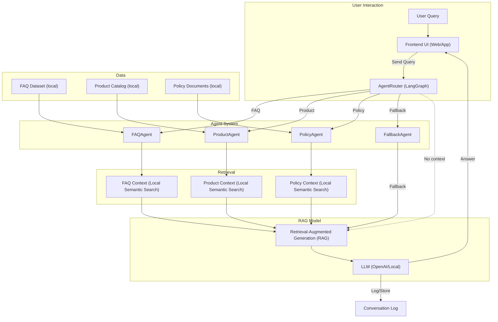

# Project Architecture Diagram

```mermaid
flowchart TD
    subgraph User Interaction
        UserQuery["User Query"]
        UI["Frontend UI (Web/App)"]
        UserQuery --> UI
        UI -->|Send Query| AgentRouter
    end

    subgraph Agent System
        AgentRouter["AgentRouter (LangGraph)"]
        AgentRouter -->|FAQ| FAQAgent
        AgentRouter -->|Product| ProductAgent
        AgentRouter -->|Policy| PolicyAgent
        AgentRouter -->|Fallback| FallbackAgent
    end

    subgraph Retrieval
        FAQAgent --> FAQContext["FAQ Context (Local Semantic Search)"]
        ProductAgent --> ProductContext["Product Context (Local Semantic Search)"]
        PolicyAgent --> PolicyContext["Policy Context (Local Semantic Search)"]
    end

    subgraph RAG_Model["RAG Model"]
        RAG["Retrieval-Augmented Generation (RAG)"]
        FAQContext --> RAG
        ProductContext --> RAG
        PolicyContext --> RAG
        AgentRouter -.->|No context| RAG
        FallbackAgent -->|Fallback| RAG
        RAG --> LLM["LLM (OpenAI/Local)"]
    end

    LLM -->|Answer| UI
    LLM -->|Log/Store| Logger["Conversation Log"]

    subgraph Data
        FAQData["FAQ Dataset (local)"]
        ProductData["Product Catalog (local)"]
        PolicyDocs["Policy Documents (local)"]
        FAQData --> FAQAgent
        ProductData --> ProductAgent
        PolicyDocs --> PolicyAgent
    end
``` 