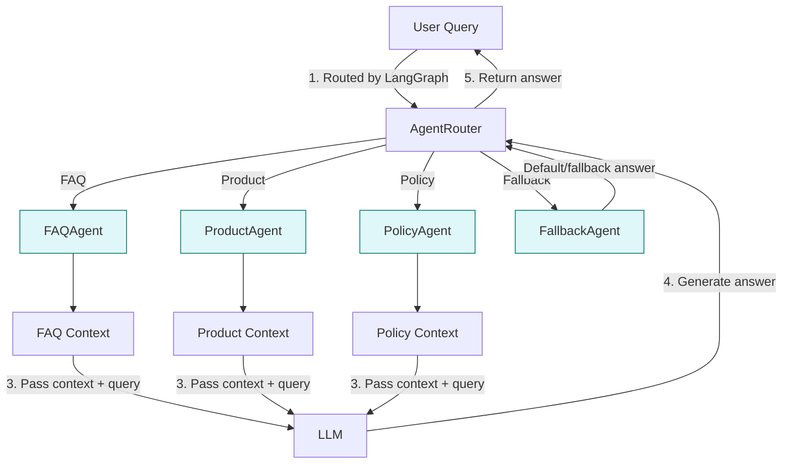

# RAG Pipeline Diagram

```mermaid
flowchart TD
    UserQuery["User Query"] -->|1. Routed by LangGraph| AgentRouter
    AgentRouter -->|FAQ| FAQAgent
    AgentRouter -->|Product| ProductAgent
    AgentRouter -->|Policy| PolicyAgent
    AgentRouter -->|Fallback| FallbackAgent
    FAQAgent --> FAQContext["FAQ Context"]
    ProductAgent --> ProductContext["Product Context"]
    PolicyAgent --> PolicyContext["Policy Context"]
    FAQContext -->|3. Pass context + query| LLM
    ProductContext -->|3. Pass context + query| LLM
    PolicyContext -->|3. Pass context + query| LLM
    LLM -->|4. Generate answer| AgentRouter
    FallbackAgent -->|Default/fallback answer| AgentRouter
    AgentRouter -->|5. Return answer| UserQuery

    classDef agent fill:#e0f7fa,stroke:#00796b;
    class FAQAgent,ProductAgent,PolicyAgent,FallbackAgent agent;
``` 